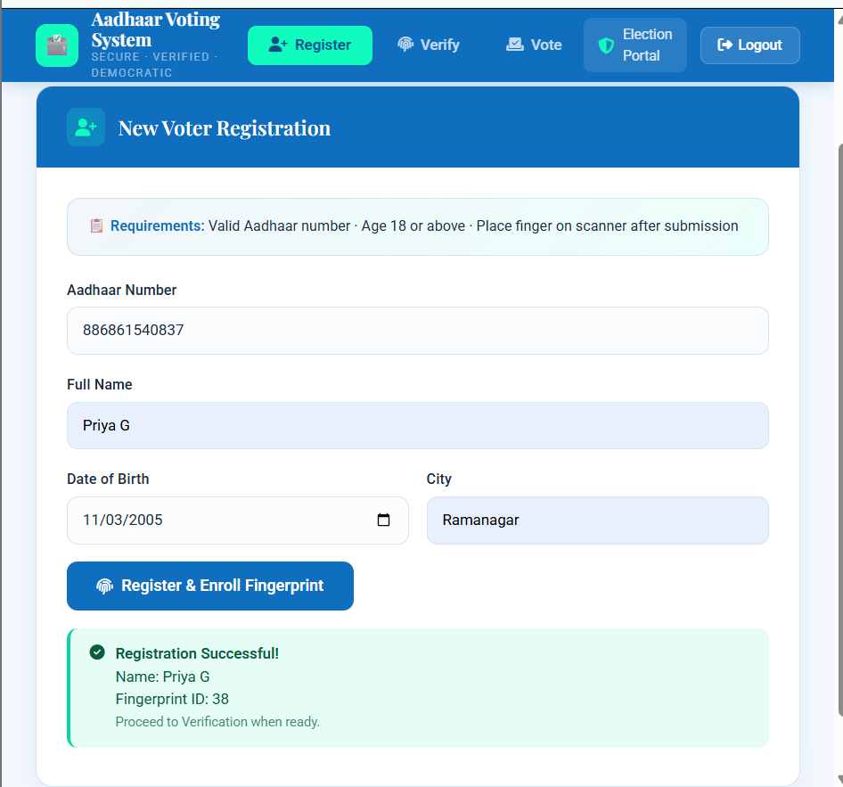
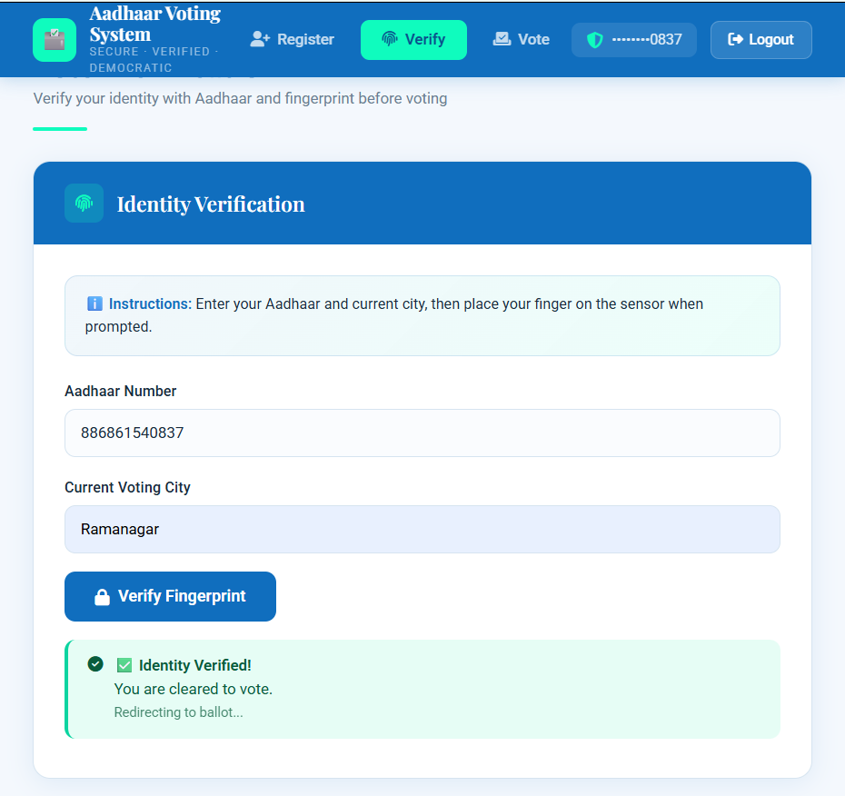
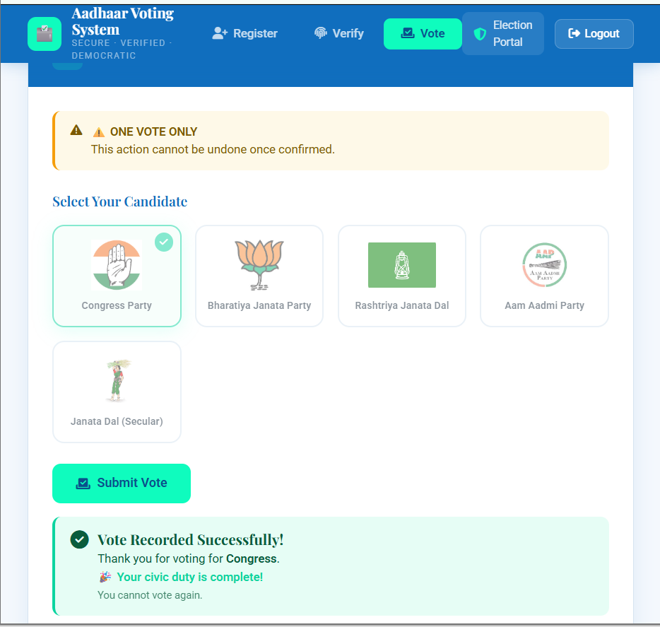
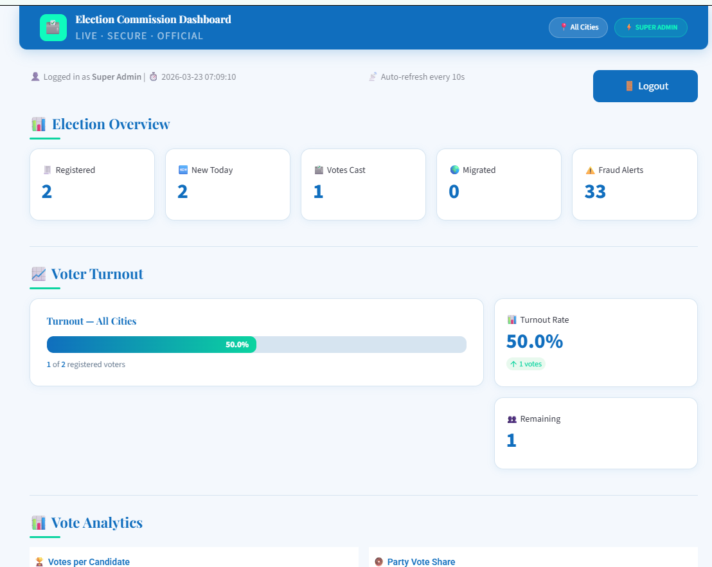
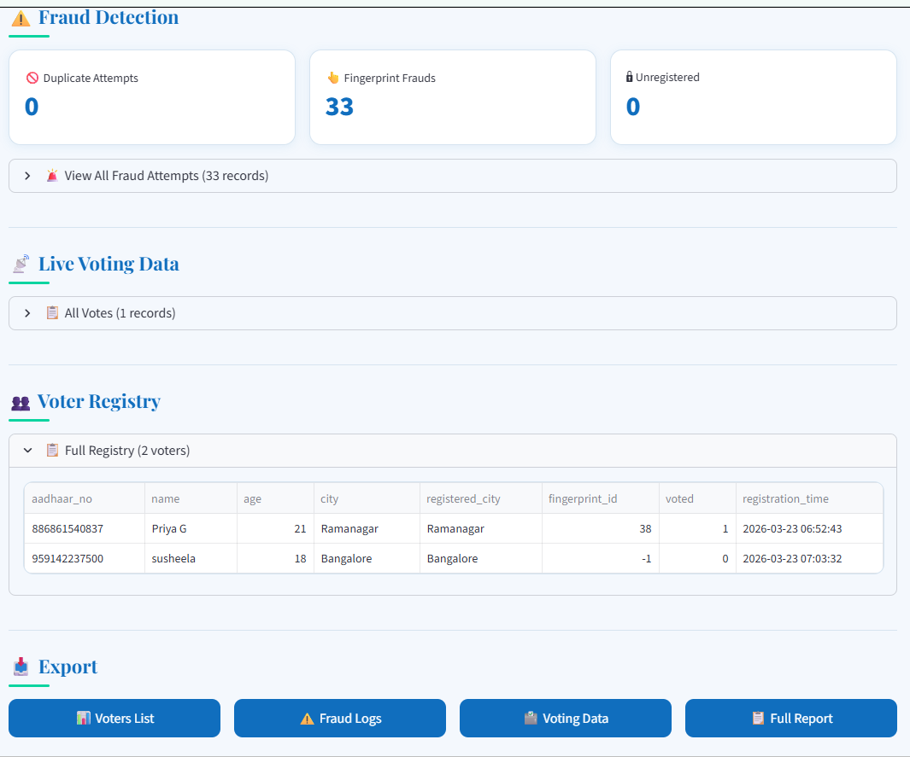
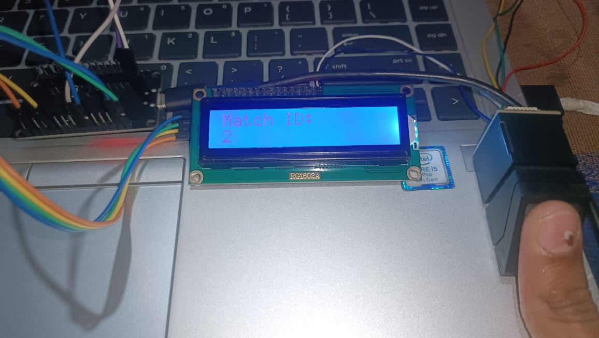

# 🗳️ Aadhaar-Based Secure Voting System

<div align="center">


[](https://voting-system-ozpz.onrender.com)
[](https://voting-system-24.streamlit.app)
[](https://python.org)
[](https://flask.palletsprojects.com)
[](https://www.arduino.cc)
[](https://supabase.com)

> **A full-stack IoT voting system combining biometric authentication, cloud backend, and live analytics dashboard — built as a third year EEE project.**

</div>

---

## 📸 Screenshots

| Register                              | Verify                            | Vote                                 |
| ------------------------------------- | --------------------------------- | ------------------------------------ |
|  |  |  |

| Dashboard Overview                               | Fraud Detection                           | Hardware                                  |
| ------------------------------------------------ | ----------------------------------------- | ----------------------------------------- |
|  |  |  |

---

## ✨ Features

- 🔐 **Biometric Authentication** — AS608 fingerprint sensor enrolled via ESP32
- 🗳️ **Secure Voting** — One vote per voter, duplicate vote prevention
- 🌍 **Migrated Voter Support** — Voters can vote from any city
- 🚨 **Fraud Detection** — Auto-blocks after 3 failed fingerprint attempts
- 📊 **Live Dashboard** — Real-time election analytics on Streamlit
- 🔄 **Auto-Refresh** — Dashboard updates every 10 seconds
- 💾 **Cloud Database** — PostgreSQL on Supabase
- 📱 **Responsive Web UI** — Works on mobile and desktop

---

## 🏗️ System Architecture

```
┌─────────────────────────────────────────────────────────┐
│                    VOTER / ADMIN                        │
│         Opens Render Web App (Browser)                  │
└────────────────────┬────────────────────────────────────┘
                     │ HTTP/HTTPS
                     ▼
┌─────────────────────────────────────────────────────────┐
│              Flask Backend (Render)                     │
│   /register  /verify  /vote  /nodemcu/*                 │
│         PostgreSQL via Supabase                         │
└────────┬────────────────────────┬───────────────────────┘
         │ Poll every 1s          │ Read DB
         ▼                        ▼
┌─────────────────┐    ┌──────────────────────────────────┐
│   ESP32 + AS608 │    │   Streamlit Dashboard            │
│   Fingerprint   │    │   (Streamlit Cloud)              │
│   Sensor + LCD  │    │   Live vote counts, analytics    │
└─────────────────┘    └──────────────────────────────────┘
```

---

## 🛠️ Tech Stack

| Layer          | Technology                                                       |
| -------------- | ---------------------------------------------------------------- |
| **Hardware**   | ESP32 DOIT DevKit V1, AS608 Fingerprint Sensor, 16x2 I2C LCD     |
| **Firmware**   | Arduino C++ (WiFiClientSecure, HTTPClient, Adafruit_Fingerprint) |
| **Backend**    | Python Flask 3.1, Gunicorn                                       |
| **Database**   | PostgreSQL (Supabase)                                            |
| **Dashboard**  | Python Streamlit                                                 |
| **Deployment** | Render (Flask), Streamlit Community Cloud                        |
| **Security**   | Session-based auth, fingerprint biometrics, fraud logging        |

---

## 🚀 Live Links

| Service                  | URL                                               |
| ------------------------ | ------------------------------------------------- |
| 🌐 Web App (Flask)       | https://voting-system-ozpz.onrender.com           |
| 📊 Dashboard (Streamlit) | https://voting-system-24.streamlit.app            |
| 🐙 GitHub Repo           | https://github.com/priyagowda11-jpg/voting-system |

---

## ⚙️ Local Setup

### 1. Clone the repo

```bash
git clone https://github.com/priyagowda11-jpg/voting-system.git
cd voting-system
```

### 2. Create virtual environment

```bash
python -m venv venv
venv\Scripts\activate        # Windows
source venv/bin/activate     # Mac/Linux
```

### 3. Install dependencies

```bash
pip install -r requirements.txt
```

### 4. Create `.env` file

```env
DATABASE_URL=your_supabase_postgresql_url
SECRET_KEY=your_secret_key
```

### 5. Run Flask locally

```bash
python app.py
```

### 6. Run Streamlit dashboard locally

```bash
streamlit run dashboard.py
```

---

## 🔌 Hardware Setup

### Components Required

| Component                | Quantity    |
| ------------------------ | ----------- |
| ESP32 DOIT DevKit V1     | 1           |
| AS608 Fingerprint Sensor | 1           |
| 16x2 I2C LCD (0x27)      | 1           |
| Push Buttons             | 3 (A, B, C) |
| Jumper Wires             | As needed   |

### Wiring

| ESP32 Pin     | Connected To   |
| ------------- | -------------- |
| GPIO 16 (RX2) | AS608 TX       |
| GPIO 17 (TX2) | AS608 RX       |
| 3.3V          | AS608 VCC      |
| GND           | AS608 GND      |
| GPIO 21 (SDA) | LCD SDA        |
| GPIO 22 (SCL) | LCD SCL        |
| GPIO 25       | Button A → GND |
| GPIO 26       | Button B → GND |
| GPIO 27       | Button C → GND |

### Arduino Libraries Required

```
Adafruit Fingerprint Sensor Library
LCD-I2C
WiFiClientSecure (built-in ESP32)
HTTPClient (built-in ESP32)
```

---

## 🗂️ Project Structure

```
voting-system/
├── app.py                 # Flask main application
├── auth_routes.py         # Admin login/logout blueprint
├── dashboard.py           # Streamlit analytics dashboard
├── requirements.txt       # Python dependencies
├── runtime.txt            # Python 3.11 for Render/Streamlit
├── Procfile               # Gunicorn start command
├── .env                   # Local environment variables (git ignored)
├── templates/
│   ├── index.html         # Main voting web UI
│   └── login.html         # Admin login page
├── static/
│   ├── css/
│   └── js/
└── voting_esp32code.ino   # ESP32 Arduino firmware
```

---

## 🔄 How It Works

### Step 1 — Register Voter

1. Admin opens web app → fills Aadhaar, Name, DOB, City
2. Flask stores in `pending_registrations{}`
3. ESP32 polls → sees `action: register`
4. LCD: "Place finger..." → voter enrolls fingerprint
5. ESP32 POSTs to `/nodemcu/register_complete`
6. Flask saves voter to Supabase DB ✅

### Step 2 — Verify Identity

1. Voter enters Aadhaar + city on web app
2. Flask stores in `pending_verifications{}`
3. ESP32 polls → sees `action: verify`
4. LCD: "Place finger..." → voter scans
5. Match → LCD: "Press A, B or C" ✅
6. No match → attempt logged, blocked after 3 fails 🚫

### Step 3 — Cast Vote

1. Voter presses physical button (A / B / C)
2. ESP32 POSTs to `/nodemcu/cast_vote`
3. Flask checks: registered? already voted? fingerprint matches?
4. Vote saved → `voted = 1` set in DB
5. LCD: "Vote Recorded! Thank You!" 🎉

### Step 4 — View Results

1. Open Streamlit dashboard
2. Live vote counts, turnout %, fraud alerts
3. Export: Voters List, Fraud Logs, Voting Data, Full Report

---

## 🛡️ Security Features

- ✅ Fingerprint biometric — prevents impersonation
- ✅ One vote per Aadhaar — `voted` flag in DB
- ✅ 3-attempt lockout — fraud logged and access blocked
- ✅ Session-based admin auth — login required for web UI
- ✅ Migrated voter tracking — separate table for cross-city votes
- ✅ All fraud attempts logged with timestamp in `fraud_logs` table

---

## 📊 Database Schema

```sql
voters        — aadhaar_no, name, age, city, fingerprint_id, voted
votes         — id, aadhaar_no, candidate, city, vote_method, vote_time
migrated_votes — id, aadhaar_no, candidate, registered_city, voting_city
fraud_logs    — id, aadhaar_no, issue, attempt_time
admins        — id, name, email, password
```

---

## 👩‍💻 Author

**Priya G**
B.E. Electrical & Electronics Engineering | Embedded AI & IoT Systems Developer

[](https://linkedin.com/in/https://www.linkedin.com/in/priya-g-07422429a/)
[](https://github.com/priyagowda11-jpg)

---

## 📄 License

This project is built for academic purposes as part of a third year engineering project.

---

<div align="center">
⭐ If you found this project useful, please star the repository!
</div>
